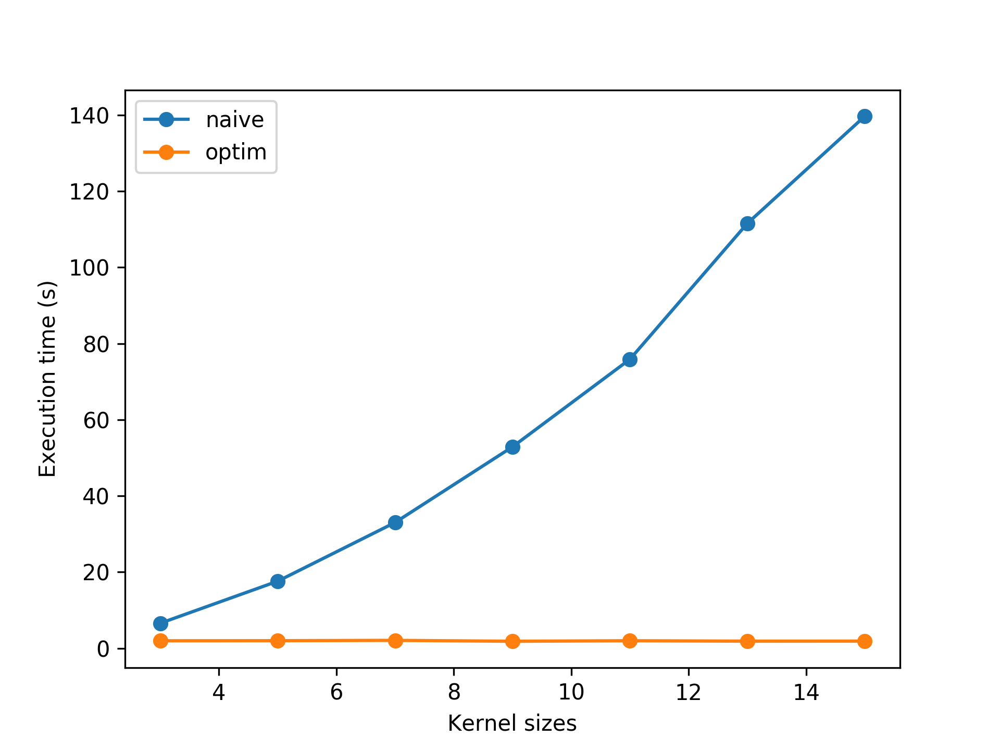
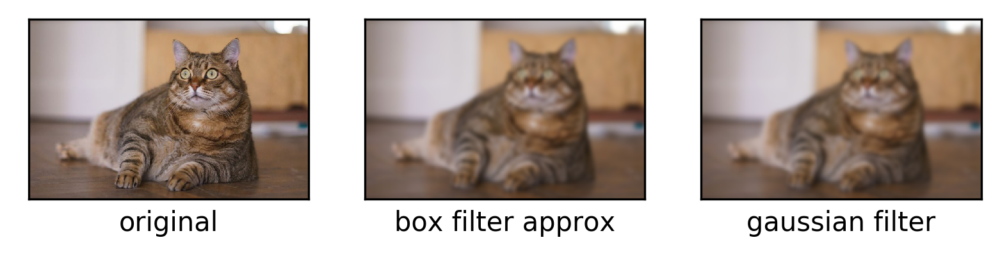

# learn-blur

Learning about various blurring filters and how to optimize them by exploiting caching and separability.

## Contents

- [x] box filter
- [x] gaussian filter
- [x] median filter
- [ ] bilateral filter

## Box Blur Optimisation

Implemented a naive Box blur filter and an optimized one that uses separablity to make runtime independent of the filter size. Running `test_box_speedup.png` generates the below plot.

For a filter size of `15`, I can get a speedup factor of 75!

## Box Blur vs Gaussian Blur

We can approximate a Gaussian filter with about 3 passes of a Box blur filter. This follows from the Central Limit Theorem.

Here's some qualitative results:

## Numba Optimization

I added numba optimization to both the Gaussian filter and the Box blur filter. This is as simple as adding an `@njit` decorator to the class's staticmethod `_filter1d`.

Because the Gaussian Filter loop is less complex than that of the Box blur filter, we can get the optimized Gaussian filter to run faster than the Box blur filter for certain kernel sizes. Note that this won't be the case for lower-level languages if both filters are implemented in C for example.

| Filter   | No Numba | With Numba |
|----------|----------|------------|
| Gaussian | 68.04    | 2.5        |
| Box (x3) | 5.31     | 3.7        |
| Speedup  | 12.82    | 0.68       |

## Median Filter

## Bilateral Filter

## Blur Animation

Just for fun, here's a visualization of how the blurred image is generated pixel by pixel.

## References

- [Speeding Up Box Blur](https://web.archive.org/web/20060718054020/http://www.acm.uiuc.edu/siggraph/workshops/wjarosz_convolution_2001.pdf)